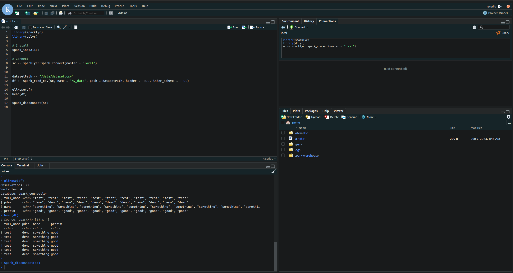

# SparkR

Easily use Spark with R scripts, within Docker environment.

## Pre-requisites

- Docker
- Docker-compose

## How to use

- Clone this repository

- Run the docker-compose command

```bash
$ docker-compose up
```

- Go to http://localhost:8787

- Login with username: <strong> rstudio </strong> and password: <strong> pass </strong> (you can change this in the docker-compose.yml file)

- Try running the code inside RStudio <kbd>Ctrl</kbd> + <kbd>Enter</kbd>, <strong> spark will take some time to install </strong>, after that you should see something like this:



- Feel free to save your code from RStudio, <strong> it will persist! </strong> RStudio folder is mounted as volume, after saving you will see your code locally @ ./rstudio.

## Next steps

1. Change dataset @ ./data/dataset.csv

2. Code R either from Rsudio or locally from ./rstudio/script.r
